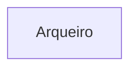
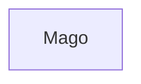
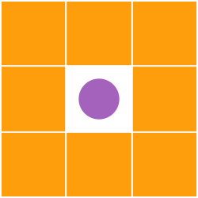
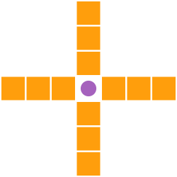
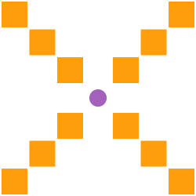
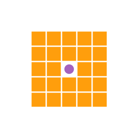
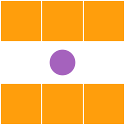
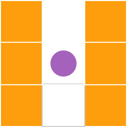

# Joguinho de RPG

## Personagens
Quanto aos atributos de um personagem, todos possuem um valor para vida (quanto dano pode receber antes de ser elimiado da batalha), ataque (dano aplicado ao adversário), defesa (resistência ao dano recebido) e velocidade (frequência com que será a sua vez de agir).\
Em seu turno, um personagem deverá escolher uma das possiveis posições do mapa e se movimentar até ela; em seguida, definir sua ação entre atacar, defender ou curar.\
O jogo conta com uma série de classes diferentes, cada qual com caracter específicas. Conheça as classes:

* Atributos: possui bom ataque; vida, defesa e velocidade medianos
* Movimentação: pode andar em um raio de 2 blocos, considerando a sua posição atual
* Ataque: ataca todos os inimigos que estiverem ao seu redor, com alcance de 1 bloco
* Defesa: aumenta a defesa em 30% até o seu próximo turno
* Cura: recupera 10% da vida total, não pode ser utilizado em outros personagens

* Atributos: possui boa defesa; vida e ataque medianos; baixa velocidade
* Movimentação: pode andar em um raio de 1 bloco, considerando a sua posição atual
* Ataque: ataca todos os inimigos que estiverem ao seu redor, com alcance de 1 bloco
* Defesa: aumenta a defesa em 40% até o seu próximo turno
* Cura: recupera 15% da vida total, não pode ser utilizado em outros personagens

* Atributos: possui boa vida e velocidade; ataque mediano; baixa defesa
* Movimentação: pode andar em um raio de 3 blocos, considerando a sua posição atual
* Ataque: ataca 3 blocos na direção escolhida (cima, baixo, esquerda, direita, uma das diagonais); o valor do dano aumenta em 20% para cada bloco de distância do inimigo em relação ao personagem
* Defesa: aumenta a defesa em 20% para os próximos 3 ataques recebidos (não acumulável)
* Cura: recupera 10% da vida total, não pode ser utilizado em outros personagens

* Atributos: possui bom ataque; velocidade mediana; baixa vida e defesa
* Movimentação: pode andar em um raio de 1 bloco, considerando a sua posição atual
* Ataque: considerando o personagem como centro, ataca em um raio de 50% da altura total do mapa no eixo y (cima e baixo, divididos igualmente) e 50% da largura total do mapa no eixo x (esquerda e direita, divididos igualmente)
* Defesa: aumenta a defesa em 80% para o próximo ataque recebido (não acumulável)
* Cura: recupera 30% da vida total, não pode ser utilizado em outros personagens

* Atributos: possui boa vida; velocidade e defesa mediana; baixo ataque
* Movimentação: pode andar em um raio de 3 blocos, considerando a sua posição atual; ignora obstáculos
* Ataque: ataca as linhas ou colunas imediatamente ao seu redor, com raio de 1 bloco
* Defesa: aumenta a defesa em 20% pelos seus próximos 2 turnos
* Cura: recupera 25% da vida dos aliados ao seu redor (não recupera a própria vida), em um raio de 2 blocos - MAS CUIDADO, para cada uso consecutivo da habilidade, o valor da cura será reduzido em 3%, até chegar ao mínimo de 10% (cada turno sem utilizar retorna 3% do valor); recupera 40% da própria vida, sem afetar aliados

## Área dos ataques

## Mapa
Um espaço 2d será gerado e alguns obstáculos serão posicionados. Obstáculos representam que aquela posição está ocupada e personagens não podem transitar por ela, a menos que possuam alguma característica que ignore essa restrição.\
Tanto a construção como a movimentação são baseadas em blocos visuais, que representam 1 espaço lógico cada.

### Finalidade do projeto
Este projeto tem como objetivo aplicar os conhecimentos acerca da linguagem Java adquiridos na cadeira Programação Orientada a Objetos e possui critérios avaliativos para a disciplina.
